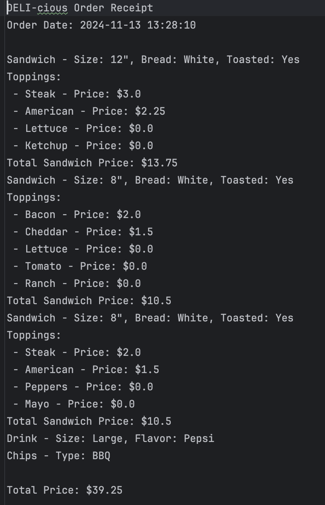

# Project Title

- DELI-cious Capstone Project

## Description of the Project

- This project is a customizable deli ordering system that allows users to create personalized meal orders. 
- Users can build their own sandwiches by choosing bread type, size, and a variety of toppings, including meats, cheeses, and regular toppings. 
- Additionally, users can add drinks and chips to their orders, review the order summary with itemized prices, and confirm their order to save a detailed receipt. 
- The application is designed to be user-friendly, offering a clear main menu, flexible customization options, and the ability to cancel or confirm orders at any stage.

## User Stories

List the user stories that guided the development of your application. Format these stories as: "As a [type of user], I want [some goal] so that [some reason]."

- As a user, I want to create a custom sandwich so that I can choose the bread type, size, and toppings I prefer.
- As a user, I want to view the available drink options so that I can select my preferred drink size and flavor.
- As a user, I want to view the available chip options so that I can add my favorite type of chips to my order.
- As a user, I want to review my order before checkout so that I can confirm all items and their quantities.
- As a user, I want to see the total price of my order so that I know how much I will pay.
- As a user, I want to save a receipt of my order so that I can have a record of what I purchased.
- As a user, I want to cancel my order at any time before checkout so that I can make changes or start a new order if needed.
- As a user, I want to select different types of toppings (meat, cheese, and regular) so that I can customize my sandwich to my taste.
- As a user, I want to add multiple premium toppings to my sandwich so that I can enjoy extra flavors even if they cost more.
- As a user, I want to add regular toppings to my sandwich without extra cost so that I can enjoy basic toppings.
- As a user, I want to specify if I want my sandwich toasted so that I can have it prepared the way I like.
- As a user, I want to view the list of all items added to my order so that I can confirm everything before I checkout.
- As a user, I want to view the different sandwich sizes available so that I can choose a size that fits my appetite.
- As a user, I want the option to exit the application from the main menu so that I can leave the ordering system when I am finished.
- As a user, I want to quickly order a BLT so that I can get a prepared sandwich with popular toppings.
- As a user, I want to quickly order a PhillyCheeseSteak so that I can get a prepared sandwich with popular toppings.
- As a user, I want to add sauces to my sandwich without extra charges so that I can personalize the flavor.

## Setup

Instructions on how to set up and run the project using IntelliJ IDEA.

### Prerequisites

- IntelliJ IDEA: Ensure you have IntelliJ IDEA installed, which you can download from [here](https://www.jetbrains.com/idea/download/).
- Java SDK: Make sure Java SDK is installed and configured in IntelliJ.

### Running the Application in IntelliJ

Follow these steps to get your application running within IntelliJ IDEA:

1. Open IntelliJ IDEA.
2. Select "Open" and navigate to the directory where you cloned or downloaded the project.
3. After the project opens, wait for IntelliJ to index the files and set up the project.
4. Locate the Program class with the public static void main(String[] args) method.
5. Right-click on the Program class and select 'Run' to start the application.

## Technologies Used

- Java: Mention the version you are using.
- Any additional libraries or frameworks used in the project.

## Demo

- Adding sandwich: 
- 
- 
- Adding prepared sandwich:
- 
- Adding drink and chips:
- 
- Checking out:
- 
- Receipt:
- 

## Future Work

Outline potential future enhancements or functionalities you might consider adding: 
- Payment options, paying by Cash or Card.

## Resources

List resources such as tutorials, articles, or documentation that helped you during the project.

- https://yearup.brightspace.com/d2l/home
- https://www.w3schools.com/java/

## Team Members

- **Name 1** - Taha Bilmen

## Thanks

Express gratitude towards those who provided help, guidance, or resources:

- Thank you to Raymond for continuous support and guidance.
- A special thanks to all teammates for their dedication and teamwork.